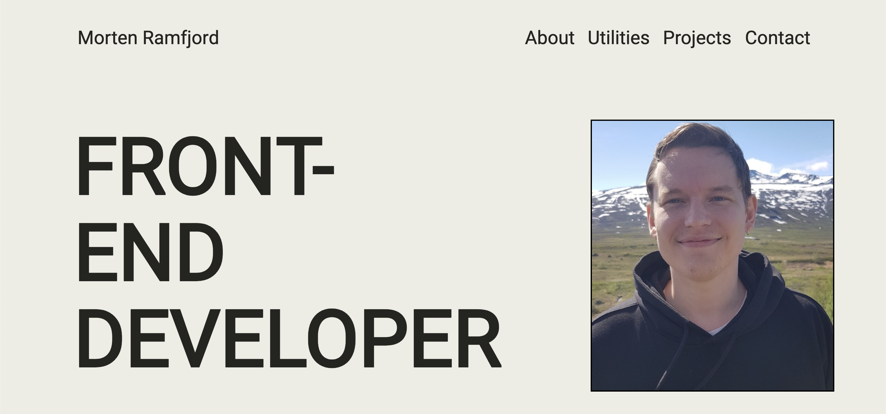

# portfolio-1



The "Portfolio-1" project is a personal website used for portraying my skills and previous work so far.

Live site: **https://shimmering-lollipop-8d3dfa.netlify.app/**

## Description

This website is a portfolio for myself, targeted towards future employees to showcase my skills and knowledge. This project were created with the following languages and programs: HTML, CSS, JavaScript, and Figma.

Some bullet points:

- Simple and clean style
- Showcasing my skills and knowledge
- Interactive and dynamic with JavaScript

## Built With

- [HTML]
- [CSS]
- [JavaScript]
- [Figma]

## Getting Started

### Installing

How to get started with the project:

1. Clone the repo:

```bash
git clone git@github.com:Ramsnes/projectExam1Private.git
```

### Running

Locate and navigate the cloned repo via the terminal using `cd` to navigate directories, and `ls` to view directories available.

To open the project in you code editor, run the following commands:

```terminal
code .
```

## Contributing

You are welcome to fork the project to review it's codes. Follow the guide below to get started.

[How to get started](https://docs.github.com/en/get-started/quickstart/fork-a-repo)

## Contact

[My e-mail](morten.ramfjord@gmail.com)
